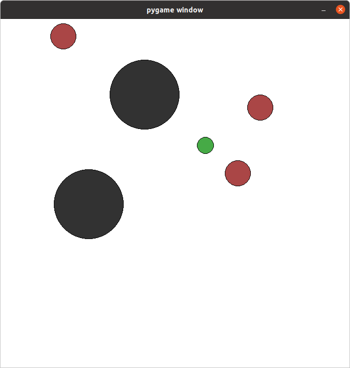
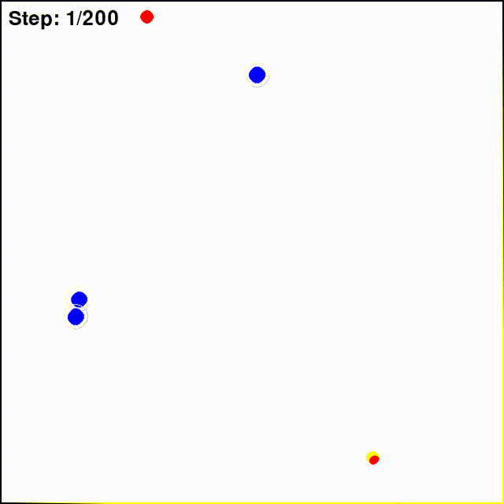

# LearningMarl
codes and notes about learning marl algorithms

# 入门环境
* [PettingZoo](https://pettingzoo.farama.org/)
* [Gymnasium](https://gymnasium.farama.org/environments/classic_control/)
* [ALE](https://ale.farama.org/environments/)

## 背景
m对n追捕问题，本意用于产生两队之间追捕、包围等数据集用作意图识别模型训练。 

## 文件结构
```
|--------- 
    |------ ACBasePettingzoo 使用pettingzoo的环境写Actor-Critic
    |------ ModifyPettingzoo 修改cam_range为固定值使得障碍物在视觉上也静止
    |------ pettingzoo 直接使用pettingzoo的环境
    |------ stable_baseline3 使用stable_baseline3的PPO

```

## pettingzoo
pettingzoo有简单的环境，可以用于MARL的入门理解。如simple_tag_v3默认环境中有1个目标`num_good`、3个追捕者`num_adversaries`和2个障碍物`num_obstacles`。但默认环境渲染时整个场景范围是随着智能体移动而改变的，以至于视角上障碍物一直在动，但实际上障碍物是不动的。

* testSimpleTag.py


pettingzoo的simple_env.py文件draw函数内cam_range随目标运动一直在变，导致视觉上障碍物也在动，修改成固定值就好了。
```py
# simple_env.py
    def draw(self):
        # clear screen
        self.screen.fill((255, 255, 255))

        # update bounds to center around agent
        all_poses = [entity.state.p_pos for entity in self.world.entities]
        cam_range = np.max(np.abs(np.array(all_poses))) # camera_range一直在变，改成cam_range = 1.0后视角固定障碍物就不动了
```

## stable_baselines3
stable_baselines3中有PPO、SAC等模型可直接使用，不像pettingzoo还需要自行写Actor-Critic。

关键点在于`def step(self, actions):`中的reward函数设计，直接影响动作的收敛。

见`stable_baseline3/ppomvs1.py`

### 目标静止
见`PPOTargetStatic.py`，目标静止，rewards只有抓捕成功和距离。训练完成后当抓捕者移动到目标附近时一直在徘徊，原因暂未知。



## 问题
常用的reward有：
* 抓捕成功与否
* 抓捕者和目标之间的距离
* 步数惩罚
* 边界惩罚

但在上述reward作用下，目标容易直奔边界或角落，抓捕者在开始时能够追逐目标，但在靠近后一直保持距离？

```sh
ffmpeg -framerate 30 -i %04d.png -vf "fps=30,scale=640:-1:flags=lanczos" output.gif
```